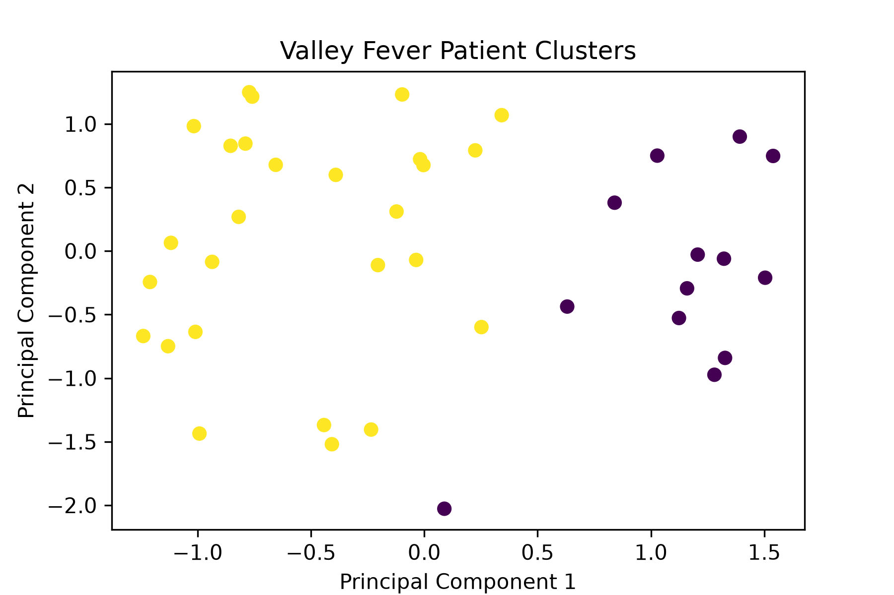

# Valley Fever Patient Clustering Project

## Overview

This project demonstrates how machine learning techniques can be used to analyze healthcare related data and identify patterns within patient information. Using a synthetic patient dataset, this project applies K-Means clustering to group patients based on similarities in selected characteristics.

## Tools Used

- Python
- pandas
- scikit-learn
- matplotlib
- K-Means clustering

## What This Project Does

This program:
- Creates a synthetic patient dataset representing healthcare-related information.
- Organizes patient data into a structured table.
- Prepares the data so it can be analyzed using machine learning methods.
- Uses K-Means clustering to group similar patients based on shared characteristics.
- Creates a visualization to display the identified patient clusters.

## Project Outcomes
The final visualization demonstrates how machine learning can be used to uncover patterns within patient data. This project provides experience with healthcare data organization, machine learning workflows, and data visualization.

## Project Visualization

Below is a visualization of the patient clusters identified by the K-Means clustering algorithm.

## Future Improvements

Potential future improvements for this project include:

- Applying the analysis to real-world de-identified healthcare datasets.
- Exploring additional machine learning approaches for patient pattern identification.
- Evaluating different clustering methods and parameters to improve analysis results.
- Expanding the dataset with additional healthcare-related variables.